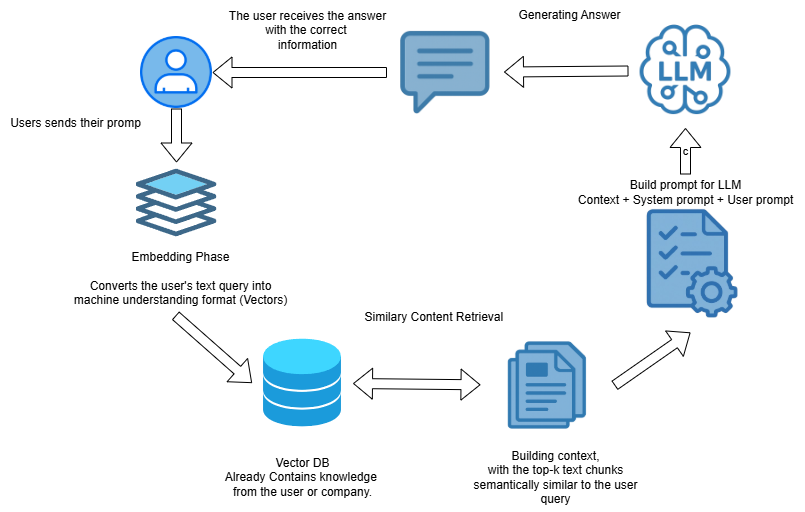

# Steve Assignment 2 Answers

#### ❓Question #1:

The default embedding dimension of `text-embedding-3-small` is 1536, as noted above. 

1. Is there any way to modify this dimension?
2. What technique does OpenAI use to achieve this?

> NOTE: Check out this [API documentation](https://platform.openai.com/docs/api-reference/embeddings/create) for the answer to question #1, and [this documentation](https://platform.openai.com/docs/guides/embeddings/use-cases) for an answer to question #2!


#### ✅ Answer #1.1:

#### YES, we can! ✅

**Modify the parameter in the request body**. If we leave the request body without setting the `dimensions` parameter, which is an `integer` and `optional` the embedding model will use its default, in this case, `text-embedding-3-small` will have a total of 1536 dimensions.

But we can add that parameter to the request body in order to change the dimensions that the embedding model will use.

**Request Body Example**

```bash
curl https://api.openai.com/v1/embeddings \
  -H "Authorization: Bearer $OPENAI_API_KEY" \
  -H "Content-Type: application/json" \
  -d '{
    "model": "text-embedding-3-small",
    "input": "The food was delicious and the waiter...",
    "encoding_format": "float",
    "dimensions": 512
  }'
```

#### Considerations

**Increasing Dimensions**

 - Larger dimensions results in higher costs and consumes more memory and storage than using smaller embeddings.

 - It captures more subtle relationships in data, but the requirements for storage increase considerably.

**Decreasing Dimensions**

 - Reducing dimensions also degrades accuracy, and semantic similarity performance.

 - Smaller vectors result in faster queries and lower memory/disk requirements

 - Easier to deploy. Devices with less memory and bandwidth can read and handle low-dimensional embeddings more easily.


 #### ✅ Answer #1.2:

 #### OpenAI uses the Matryoshka Representation Learning (MRL technique)

 The Machine learning models often convert inputs into fixes-lenght vectors called embeddings. But not all the devices have the same resource available (memory, compute) a fixed embedding can be too big (bandwidth/memory on a phone) or too small (losing accuracy on a server)

 During training, the model learns to put the most important information into the first few dimensions, the next most important into the next chunk, and so on, so that any prefix of the full vector can stand on its own.

 This approach gives you one model that flexibly adapts to different speed, memory, or accuracy requirements—small, fast embeddings when you need them, big, rich embeddings when you don't mind the cost.


 #### ❓Question #2:

What are the benefits of using an `async` approach to collecting our embeddings?

> NOTE: Determining the core difference between `async` and `sync` will be useful! If you get stuck - ask ChatGPT!

#### ✅ Answer #2:

 - First benefits of using an `async` approach is that the even loop can run other tasks while we are waiting the embedding response instead of sitting idle.

 - If using FastAPI for example, if it manages other work in the process, it won't be blocked waiting for each request to finish in order to start new tasks or embeddings.

 - Using `async` you can handle multiple simultaneous requests in a single thread, and it is lighter and scalable.

 - With `sync` does a task at a time, it blocks the thread until the process it finished. Nothing else runs in that thread during the request.

**Python example**
```python 
# Sync
def get_all_embeddings(texts):
    results = []
    for t in texts:
        emb = sync_get_embedding(t) # blocks until done
        results.append(emb)
    return results

# Async
async def get_all_embeddings_async(texts):
    tasks = [async_get_embedding(t) for t in texts]   # launch all requests without waiting immediately
    # await them concurrently
    return await asyncio.gather(*tasks)

```

#### ❓ Question #3:

When calling the OpenAI API - are there any ways we can achieve more reproducible outputs?

> NOTE: Check out [this section](https://platform.openai.com/docs/guides/text-generation/) of the OpenAI documentation for the answer!


#### ✅ Answer #3:

 OpenAI has three techniques to get more reproducible outputs when calling the OpenAI API
 
1. Pin to a specific model snapshot

    Lock model parameter to a concrete snapshot like `gpt-4.1-2025-04-14` so the weights never shift under you.

2. Use reusable prompts

    Author prompts in the dashboard with fixed IDs and variable slots. This guarantees the exact same prompt text every time.

3. Build and run evals

    Put prompts into a structured evaluation suite so we can automatically detect any output drift when upgrading models or tweak prompts.


## Build and run evals

Put prompts into a structured evaluation suite so we can automatically detect any output drift when upgrading models or tweak prompts.

```python
from openai import OpenAI

client = OpenAI()

response = client.responses.create(
    model="gpt-4.1-2025-04-14",   # 👈 snapshot pinning
    input="Write a one-sentence bedtime story about a unicorn."
)

print(response.output_text)
```

## Use reusable prompts

In the OpenAI dashboard we can save prompt templates with an id and version, then supply only structured variables in the code. This ensures the exact same prompt text (and ordering) across calls.

```python
from openai import OpenAI

client = OpenAI()

response = client.responses.create(
    model="gpt-4.1-2025-04-14",
    prompt={
        "id": "pmpt_abc123",        # 👈 dashboard prompt ID
        "version": "1",             # 👈 fixed version
        "variables": {
            "customer_name": "Jane Doe",
            "product": "40oz juice box"
        }
    }
)

print(response.output_text)
```

## Build and run evals

Create an automated "eval" suite that feeds prompts into the API and checks the outputs against golden answers. Whenever we change models or prompts, rerun the eval to catch any unintended drift.

```python
# Conceptual example using the OpenAI Evals framework
import evals
from openai import OpenAI

client = OpenAI()

# Define an eval that runs our prompt against a small test set
eval = evals.Eval(
    name="greeting_eval",
    completion_fns=[lambda input: client.responses.create(
        model="gpt-4.1-2025-04-14",
        input=input
    ).output_text],
    dataset="greeting_test_examples.jsonl",  # each line: {"input": "...", "ideal": "..."}
)

# Run the eval and surface any mismatches
results = eval.run()
print(results.summary())
```


#### ❓ Question #4:

What prompting strategies could you use to make the LLM have a more thoughtful, detailed response?

What is that strategy called?

> NOTE: You can look through ["Accessing GPT-3.5-turbo Like a Developer"](https://colab.research.google.com/drive/1mOzbgf4a2SP5qQj33ZxTz2a01-5eXqk2?usp=sharing) for an answer to this question if you get stuck!


#### ✅ Answer #4:
 

There is a strategy that we add explicit instructions such as `Think through your response step by step.` to the prompt.

This directs the model to lay out its reasoning process in sequence, which naturally yields more detailed, careful explanations and reduces shallow or rushed answers.

**What is this strategy called?:** 

#### Chain of Thought (CoT) Prompting

* Surfaces hidden assumptions and calculations.
* Reduces "shallow" answers or overlooked details.
* Improves accuracy on tasks that require multistep reasoning (dates, arithmetic, logic, etc.).


#### Example 1 - Travel-time Reasoning

**Without CoT**

```python
reasoning_problem = """
Billy wants to get home from San Fran. before 7 PM EDT.
It's currently 1 PM local time.
Billy can either fly (3 hrs) and then take a bus (2 hrs),
or take the teleporter (0 hrs) and then a bus (1 hr).
Does it matter which travel option Billy selects?
"""

messages = [user_prompt(reasoning_problem)]
response = get_response(client, messages)
```

A one-shot prompt like this often makes the model miss the time-zone detail (1 PM PT = 4 PM EDT) and incorrectly say **"Either works."**

---

**With CoT**

```python
messages = [
    user_prompt(reasoning_problem + " Think through your response step by step.")
]
response = get_response(client, messages)
```

Because the model is told to reason openly, it now spells out something like:

1. 1 PM in San Fran. = 4 PM EDT.
2. Flying takes 3 h → 7 PM EDT.
3. +2 h bus → 9 PM EDT → too late.
4. Teleporter 0 h + 1 h bus → 5 PM EDT → on time.

**Final answer:** Billy must choose the teleporter route. The step-by-step chain exposes the correct logic.

---


# 🏗️ Activity #1: 
## Enhancing the RAG application

### RAG process diagram



### 📋 Enhanced RAG Application Summary

The Enhanced RAG application successfully implements a complete Retrieval Augmented Generation pipeline with PDF document support. Here's a brief overview of the implementation:

#### **Core Components:**

1. **Document Loading & Processing:**
   - `PDFFileLoader`: Extracts text content from PDF files using `pypdf`
   - `CharacterTextSplitter`: Chunks documents into manageable segments (1000 chars with 200 char overlap)
   - Supports both text files and PDF documents

2. **Embedding Generation:**
   - `EmbeddingModel`: Wrapper for OpenAI's `text-embedding-3-small` model
   - Async implementation for efficient batch processing
   - Generates 1536-dimensional vectors for semantic representation
   - Uses cosine similarity for vector comparison

3. **Vector Database:**
   - In-memory storage using `defaultdict(np.array)`
   - Efficient similarity search with configurable `k` results
   - Supports both text and vector-based queries

4. **RAG Pipeline:**
   - `RetrievalAugmentedQAPipeline`: Orchestrates the complete RAG workflow
   - Configurable response styles and similarity score inclusion
   - Structured prompt templates with system and user roles
   - Returns comprehensive results including context, scores, and prompts used

#### **Key Enhancements for PDF Support:**

- **PDF Text Extraction**: Leverages `pypdf` library to extract plain text from PDF documents
- **Batch Processing**: Handles multiple PDF files in a directory with error handling for corrupt files
- **Spanish Language Support**: Successfully processes Spanish traffic safety documents
- **Semantic Search**: Enables natural language queries against PDF content example: "autoriza a conducir vehículos automotores"

The implementation demonstrates a production-ready RAG system capable of handling real-world document processing, efficient embedding generation, and intelligent question-answering based on retrieved context.


