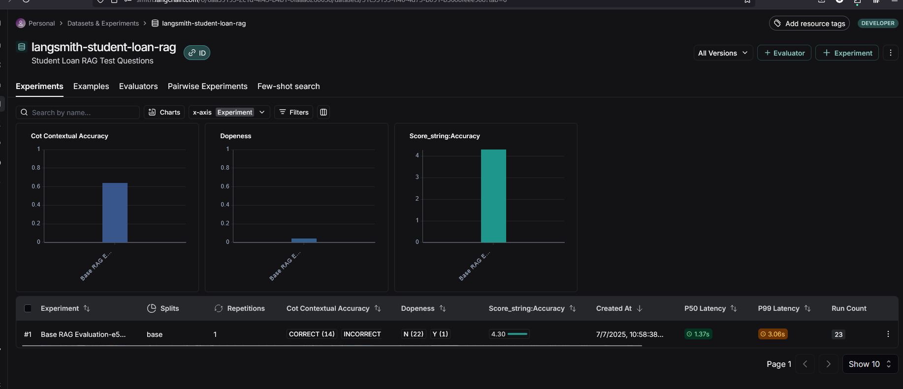

##### 🏗️ Activity #1:

While there's nothing specifically wrong with the chunking method used above - it is a naive approach that is not sensitive to specific data formats.

Brainstorm some ideas that would split large single documents into smaller documents.
##### ✅ Answer
1. `Heading-/outline-based segmentation`
2. `Semantic similarity drop-point segmentation`
3. `Page-first, token-budget-second splitting for PDFs`

##### ❓ Question #1:

What is the embedding dimension, given that we're using `text-embedding-3-small`?

You will need to fill the next cell out correctly with your embedding dimension for the rest of the notebook to run.

##### ✅ Answer
embedding_dim = 1536 

#### ❓ Question #2:
LangGraph's graph-based approach lets us visualize and manage complex flows naturally. How could we extend our current implementation to handle edge cases? For example:
- What if the retriever finds no relevant context?  
- What if the response needs fact-checking?
Consider how you would modify the graph to handle these scenarios.

##### ✅ Answer

Maybe Adding a context validation node after retrieval that checks if any documents were returned. If no context exists, route to a fallback node that returns "I don't have enough information" instead of proceeding to generation.

We can add a fact-checking node after generation that uses another LLM call to verify the response against the original context. If the response contains information not supported by the context, route to a revision node that generates a more conservative answer.

To handle those scenarios I would Change from a linear flow (retrieve → generate → END) to a branching flow with conditional edges:

retrieve → validate_context → [generate if valid context OR fallback_response if no context]
generate → fact_check → [END if accurate OR revise_response if inaccurate]

This creates multiple paths through the graph based on the quality of retrieved context and generated responses.

#### 🏗️ Activity #2:

Complete the prompt so that your RAG application answers queries based on the context provided, but *does not* answer queries if the context is unrelated to the query.

##### ✅ Answer
from langchain_core.prompts import ChatPromptTemplate

SYSTEM_TEMPLATE = (
    "You are a helpful assistant."
    "Answer the user’s QUERY using only the information contained in #CONTEXT. "
    "If the answer is not present, respond exactly with: I don't know"
    "Only use the provided context. Do not use external knowledge."
    "Only provide answers when you are confident the context supports your response."
)

HUMAN_TEMPLATE = """
#CONTEXT:
{context}

QUERY:
{query}

Use the provide context to answer the provided user query. Only use the provided context to answer the query. If you do not know the answer, or it's not contained in the provided context respond with "I don't know"
"""

chat_prompt = ChatPromptTemplate.from_messages([
    ("system", SYSTEM_TEMPLATE),
    ("human", HUMAN_TEMPLATE)
])

# LangSmith_and_Evaluation

#### 🏗️ Activity #1:

Include a screenshot of your trace and explain what it means.

#### ✅ Answer

# TRACE

The trace shows that our baseline RAG system answered 61 % of the student-loan questions correctly. Only 4 % of answers were flagged as openly uncertain (dopenness = y), which suggests we may need better fallback behaviour. The qualitative grader (score_string:accuracy) gives us an average 4.3 / 10—fair, but leaves room for improvement. Median latency is 1.37 s with a P99 of 3 s, and the total evaluation run cost was about 28 cents for 32 k tokens.

#### ❓Question #1:

What conclusions can you draw about the above results?

Describe in your own words what the metrics are expressing.

#### ✅ Answer

Out of 22 test questions, the current RAG system got about two-thirds right. It almost never admits when it isn’t sure, and the qualitative grader rates most answers in the lower half of its 10-point scale. Latency is comfortably under two seconds for typical calls, and the full evaluation cost less than thirty cents. Accuracy and answer quality need attention, while speed and cost are already in a good place

